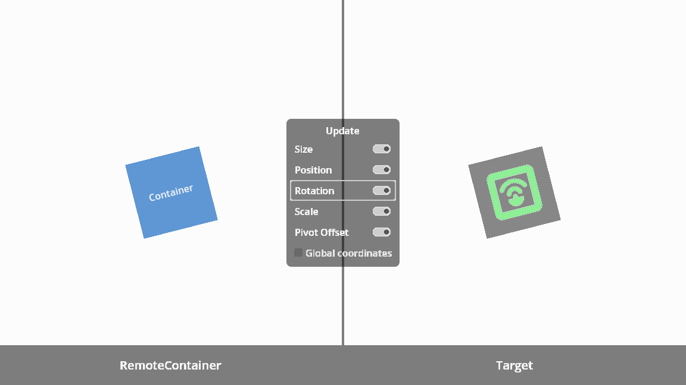

#  RemoteContainer

RemoteContainer pushes its own transform to another Control derived node in the scene.

> [!NOTE]
> Once the add-on is enabled, its documentation can be accessed directly from the Godot IDE (``F1``).
